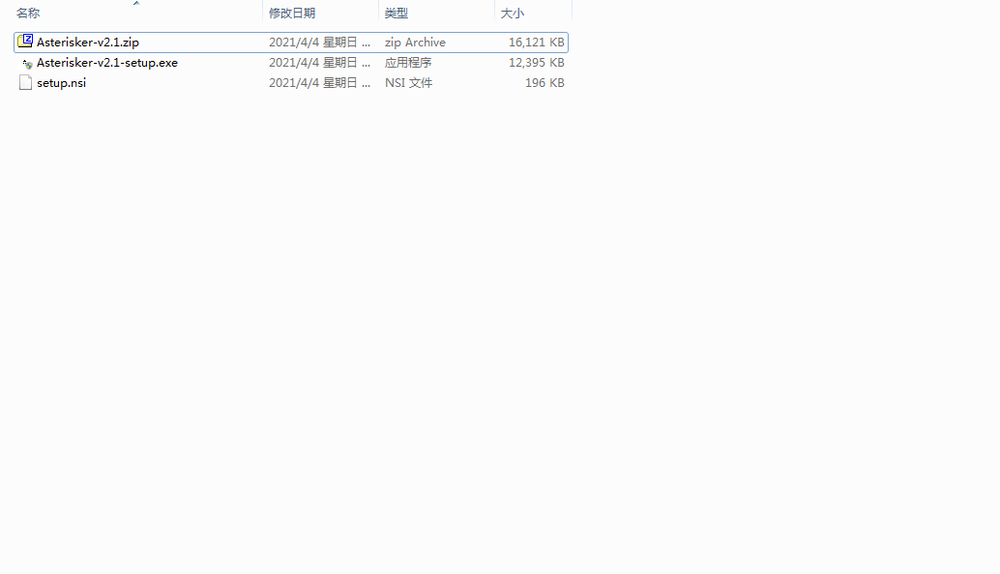
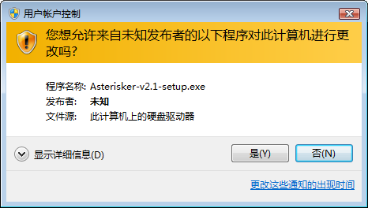
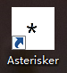
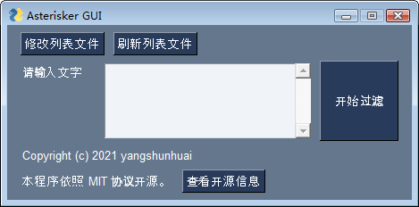
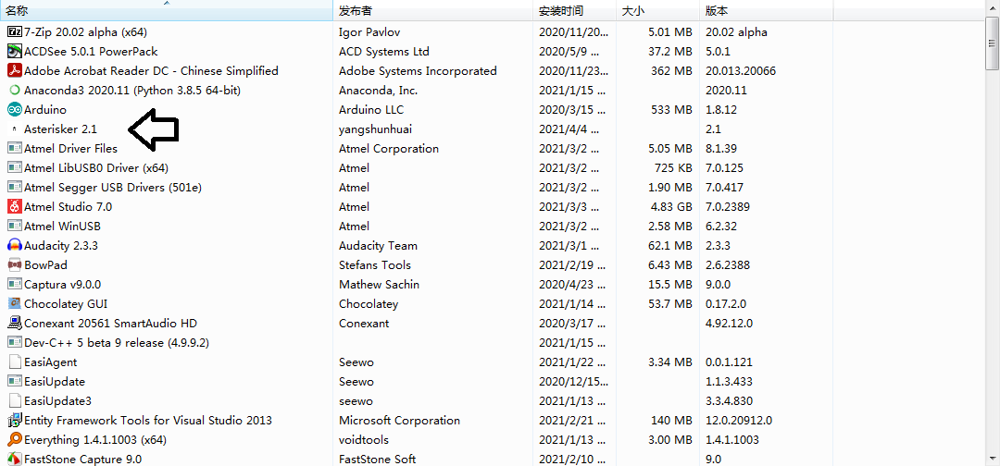
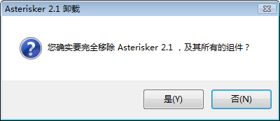

# Asterisker 使用说明

欢迎使用Asterisker！

## 安装软件

1. 打开`bin/2.1/`文件夹

   

2. 运行`Asterisker-v2.1-setup.exe`程序。如果Windows弹出管理员授权窗口，请选择`是`。

   

3. 按照安装程序的指示，安装`Asterisker`。

4. 打开桌面上的快捷方式。

   

5. 按照程序上的文字指示即可使用。

   

## 卸载

1. 打开`控制面板->程序与功能`，找到`Asterisker`。

   

   在Windows 8.1以上操作系统中，也可以在`设置`UWP应用中卸载。

2. 双击`Asterisker`，按照安装程序指示进行卸载。

   